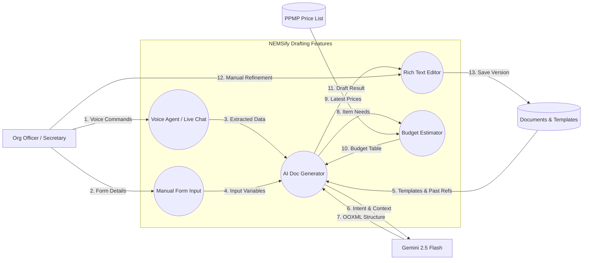
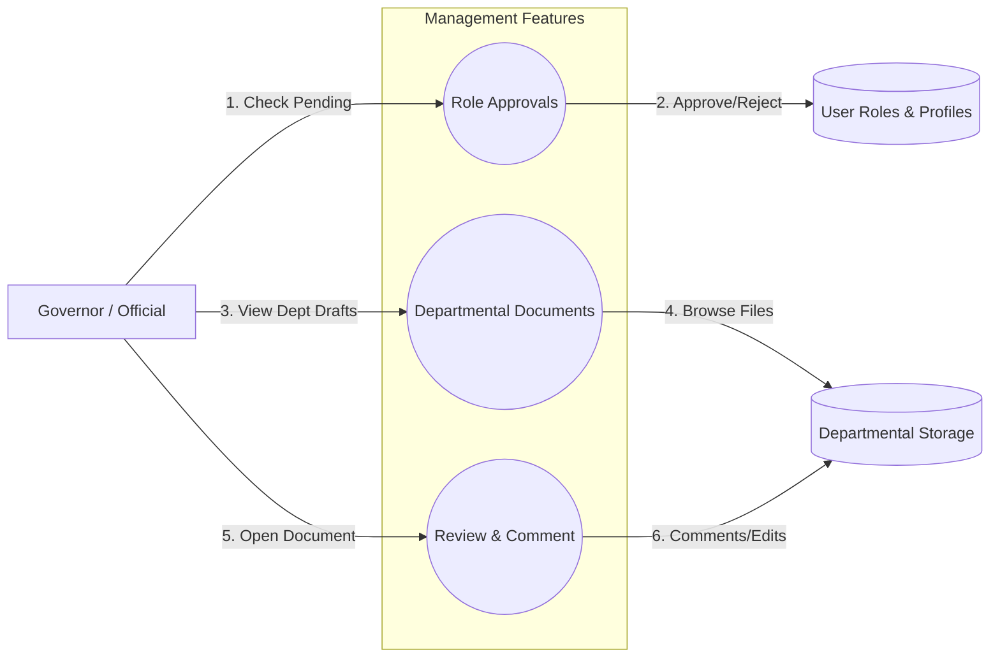
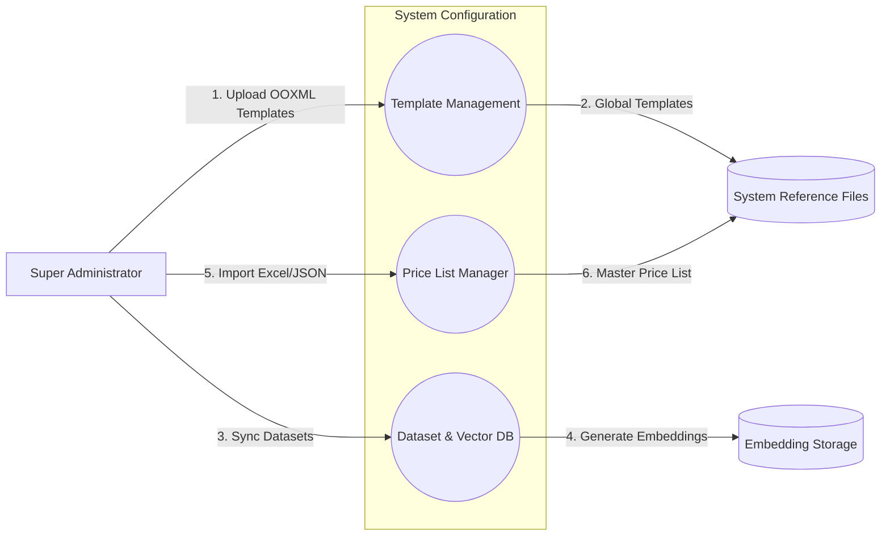

# Project Architecture: NEMSify (Docuflow)

This document explains how the NEMSify system works, focusing on the flow of data between Organization Officers, University Officials, the Gemini AI Engine, and Supabase Cloud Storage.

---

## 1. Description of Shapes
To understand the diagrams below, here is a simple guide:

| Shape | Meaning | Description |
| :--- | :--- | :--- |
| **Rectangle** | **Person / External System** | A user (Officer, Governor, Admin), the Gemini AI Engine, or Supabase. |
| **Circle** | **Feature / Process** | A part of the app that processes data or performs an action. |
| **Parallel Lines** | **Cloud Storage** | Where your data, templates, and documents are saved (Database). |
| **Arrows** | **Data Direction** | Shows where the information is going. |

---

## 2. Organization Officer Application (Drafting & Generation)
This diagram shows how student organization officers generate and refine academic documents using AI and reference materials.

**What happens here:**
- **Manual & Voice Drafting**: Officers can either fill out a structured form or use the **Voice Agent** to naturally describe the activity details.
- **AI-Powered Generation**: The system uses **Gemini 2.5 Flash** combined with **RAG (Retrieval Augmented Generation)** to pull relevant templates and similar past documents (including Activity Proposals, Official Letters, and Constitution & By-Laws) from the database, ensuring high compliance with university standards.
- **Budget Estimator**: For Activity Proposals, the system cross-references the **PPMP Price List** to provide accurate budget estimates and automatically generate a formatted Word table.
- **Rich Text Editor**: Officers can manually adjust the AI-generated draft in a customized editor before saving it to the cloud storage.

---

## 3. University Official / Governor Application (Oversight)
This shows how Governors and University Officials manage departmental activities and role approvals.

**What happens here:**
- **Role Approvals**: Governors review and approve requests from student officers to join their specific department (CITE, CAS, etc.).
- **Departmental Oversight**: Officials can see all documents marked as "Department" visibility, allowing for easy auditing of upcoming activity proposals.
- **Review & Comment**: Officials can open documents directly to provide feedback or make necessary corrections.

---

## 4. University Super-Admin Application (System Root)
This shows how the platform's core logic and datasets are managed by the top-level administrator.

**What happens here:**
- **Template Management**: The Super Admin uploads and manages the master OOXML templates that define the university's document standards.
- **Dataset & Vector DB**: To keep the AI accurate, the Super Admin manages the "Reference Datasets." The system automatically generates **vector embeddings** for these files to allow high-speed RAG searches.
- **Price List Manager**: Administrators import current **PPMP Price Lists** (via Excel/JSON) to ensure that student budget estimates always reflect current market trends.
